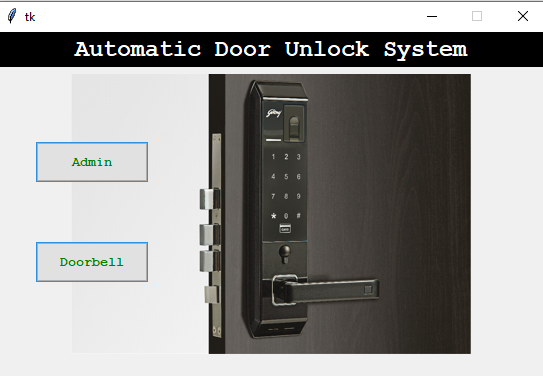

# Automatic-Door-Unlocking-System-Using-Face-Recognition

## Flow of the project
• First we store the data of person in dataset by taking few different angle images of a person's face and store it in dataset folder by his name.

• When a person will arrive in front of the door then camera captures his image and test with the model built and if he is authorized door will be unlock else will be stayed lock.

## Working of Application :

### Home Page

### Login Page

Note : System contains inbuild username and password as well as admin can also use from authorized user stored username and password.

### Admin Page

### Existing Users

### New User Registeration

Note : User need to enter his/her name and password select create dataset if user doesnot exist then it will open a window to capture 300 images.

### Training the model

Note : Captured images are stored in dataset/names_of_entered_user folder and once training is done it will pop-up a message

### Detecting the face on doorbell

When a person rings the doorbell a window will be popped to capture persons faces

If it is matching with 50% confidenece then a door will be opened else remain closed

